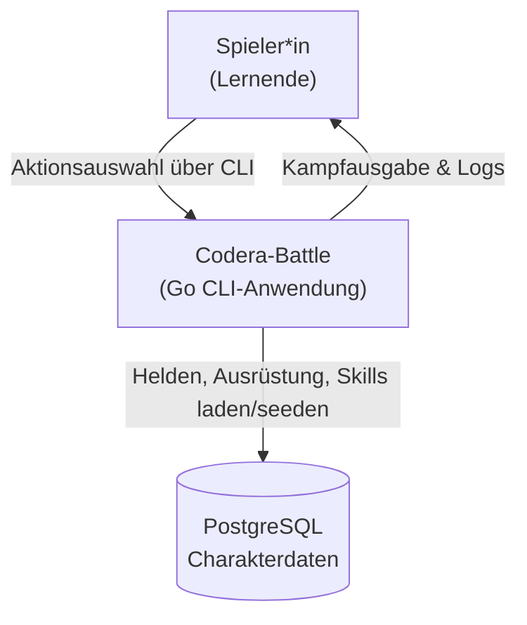
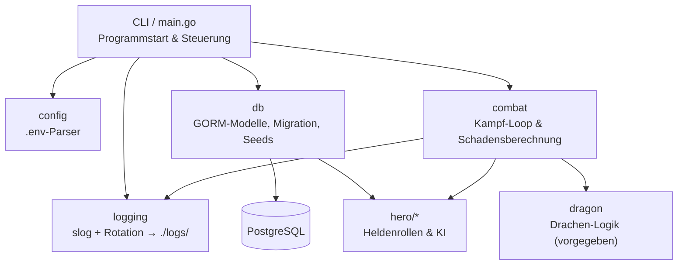
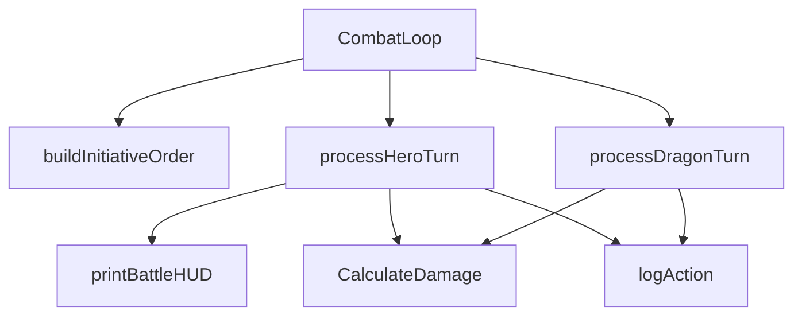
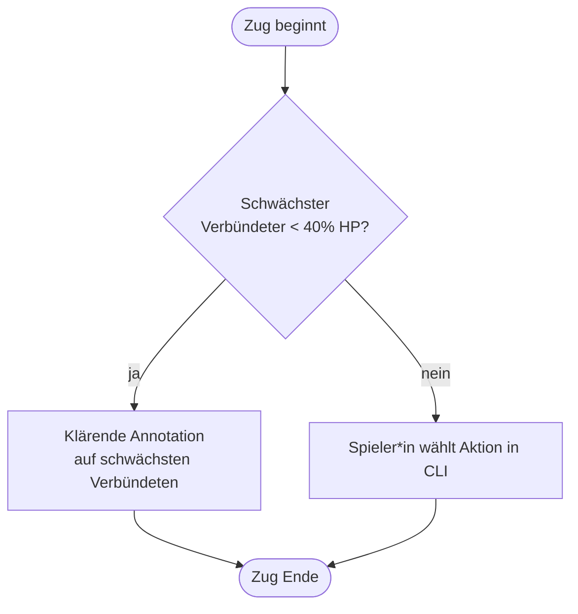
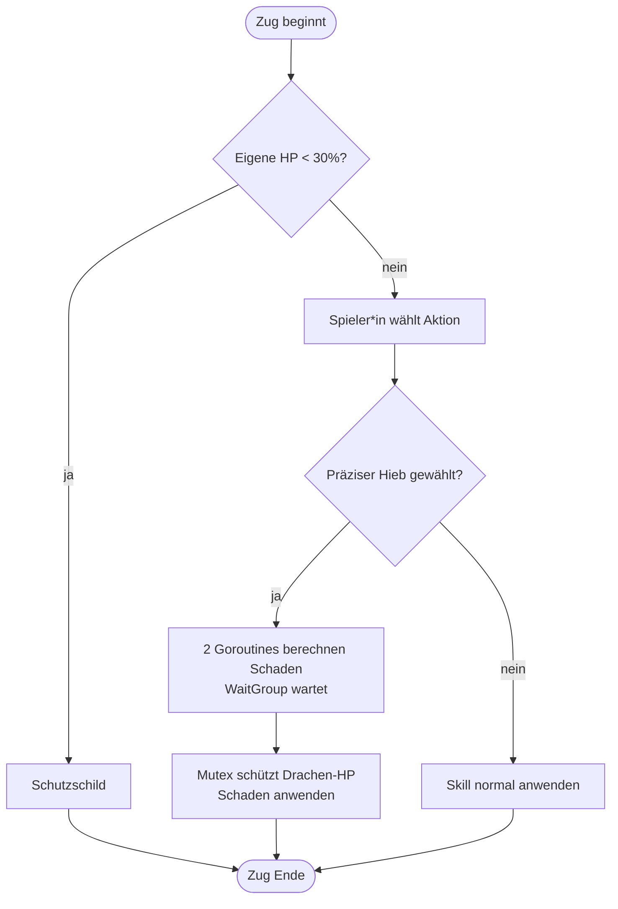
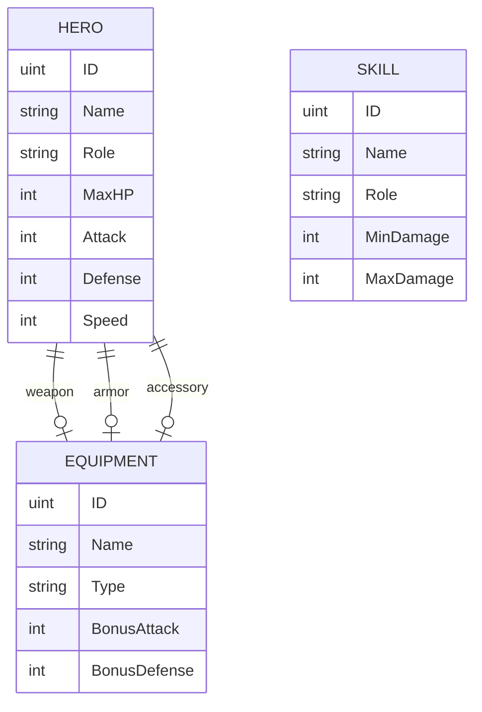

# Gruppendokumentation – Codera-Battle (M319)

> Repository-Link: _hier den Link zum Git-Repository eintragen_

## 1. Überblick

Codera-Battle ist ein rundenbasiertes CLI-Kampfspiel in Go. Eine Heldengruppe
kämpft gegen den vorgegebenen Entropie-Drachen. Charakterdaten liegen in einer
PostgreSQL-Datenbank (GORM), die Kampflogik läuft in der Kommandozeile.

## 2. C4-Modell

### 2.1 Layer 1 – System-Kontext

Der Spieler bedient das System über die CLI. Das System lädt die Charakterdaten
aus PostgreSQL und steuert den Kampf gegen den intern definierten Drachen.

### 2.2 Layer 2 – Container

### 2.3 Layer 3 – Komponenten des `combat`-Pakets (Bonus)

## 3. Activity-Diagramme der Rollen

> Jedes Gruppenmitglied ergänzt hier das Activity-Diagramm seiner eigenen Rolle.
> Nachfolgend Beispiele für die Auto-KI zweier Rollen.

### 3.1 Arkan-Dokumentar*in (Heil-Strategie)

### 3.2 Funktions-Krieger*in (Double Strike)

## 4. Datenmodell (GORM)

Skills sind über das Feld `Role` einem Helden zugeordnet.

## 5. Aufgabenverteilung

| Person | Rolle | Schwerpunkt M319 |
|--------|-------|------------------|
| Ron | Arkan-Dokumentar*in (Magier*in) | C4-Diagramme, Clean Code, Linter |
| Lumjan | Daten-Druide (Formwandler*in) | GORM-Modelle, DB-Connection |
| Florentin | Runenschmied*in (Architekt) | DB-Migration & Seeds |

> Die Git-History weist pro Person die Commits der eigenen Rolle nach.
